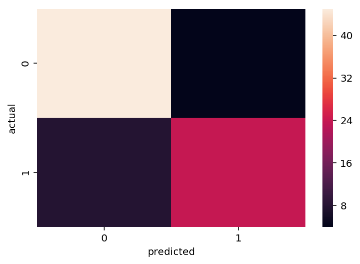
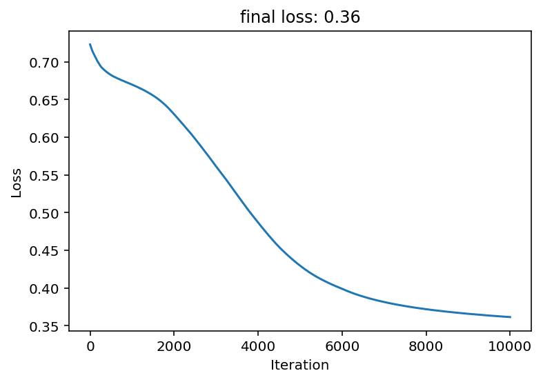

## Keep it Simple
By: Jordan Crawford-O'Banner

Heart disease is the number one cause of death worldwide. As such, Driven Data has proposed a challenged to use a specific dataset from the Cleveland Heart Disease Database to try and create a machine learning model that can predict if a person has heart disease based upon certain factors. The data has 13 different health factors that are linked to heart disease. This is a classification problem because the goal is to determine only if they have heart disease or not. There are a few approaches to the problem that can be taking by using machine learning. This notebook will compare a few of those approaches.

The two approaches that we will be taking are by comparing a simple regression model and a deep learning model. Each of these approaches has their advantages and their disadvantages. The simple regression model has a lot of parts that can be analyzed in detail. The different parameters within the model can be tuned, and it is easy to test its accuracy. The deep learning model on the other hand, tend to be more accurate when they are done correctly. However, they can only be changed from the surface, and it can be very difficult to identify the inner workings of their algorithms.

The data shown above contains thirteen explanatory variables and one target variable. The variables include the age and sex of the respondent. The data corresponds people who are as male to 0 and people who are female to 1. There is also chest pain, which is recorded on a scale from 1 to 4. Other variables include resting blood pressure, serum cholesterol, if fasting blood pressure is greater 120 mg/dl , resting electrocardiograph results, maximum heart rate achieved, exercise induced angina, ST depression induced by exercise relative to rest, the slope of the peak exercise ST segment, number of major vessels colored by flourosopy, and the status of the respondents thalamus. The target value is whether or not the respondent has heart disease, and it is recorded as either being a 1 if they do have heart disease or 0 if they do not.

#### Lasso Regression

The data has a lot of variables to keep track of, but a machine learning model does not need to be aware of the meaning of the variables. Nonetheless getting a better understanding of which variables are more influential on predicting a respondent has heart disease by using lasso regression is useful.

The lasso regression shows that chest pain and the status of the respondents thalamus is the most important variables within the dataset. The thalamus data is the most influential data within the dataset. Although these two variables are the most influential, all the variables will still be used in the models in order to ensure that they can be as accurate as possible.

#### Deep Learning Model

A deep learning model was implemented to predict if a respondent has heart disease. Two hidden layers were used within the model. The first one used tanh as the activation function. A tanh function is similar to a logistic function, but it keeps values between -1 and 1. This function was chosen because it is similar to a logistic function, which means that it will put the model closer to the answer it is searching for. The second hidden layer uses a logistic function. Both of these through a logistic function and arrive at the answer. The deep learning algorithm uses this model and performs gradient descent on it in order to minimize the loss.

After the model is run for ten thousand iterations, the loss managed to be minimized to only 0.38. After minimizing the loss for the model and finding the optimal parameters, the model was used on a test dataset to see if it could correctly predict whether or not the respondents had heart disease. Below is the confusion matrix generated using those predictions.

The confusion matrix shows that the model does get a majority of its predictions are correct. Using the values in the confusion matrix, you can calculate that 83 percent of the predictions were correct.

This model was fairly accurate, but it is possible that there is a more accurate model if different activation functions and a different number of hidden layers are used. Therefore running a few more models may prove useful for getting a better number of predictions.

The next model that has one hidden layer that uses a logistic activation function, and the output layer still uses a logistic function. This model was also run for ten thousand iterations.

Loss Graph        |  Confusion Matrix
:-------------------------:|:-------------------------:
  |  

This model has more loss than the previous one, the model coming to a final loss of 0.42 after running through many iterations of gradient descent. The confusion matrix shows that the model is still very accurate. There are mostly correct predictions and only a few incorrect predictions. 85 percent of this model's predictions are correction, which is slightly better than the previous model.

One last model to present has two hidden layers. The first hidden layer uses a logistic activation function, and the second layer uses a relu activation function.

Loss Graph        |  Confusion Matrix
:-------------------------:|:-------------------------:
  |  

The current model has the lowest loss yet with 0.36. The confusion matrix shows similar results to the previous models, showing that the model makes  large number of correct predictions. This model gets 83 percent of its predictions correct, which is the same as the first model that was run.

#### Logistic Regression Model

The most accurate model that was made using the deep learning model predicted 85% of the respondents correctly. Now that an accurate deep learning model has been created, we can create a logistic regression model and compare the accuracy of both methods. A logistic regression model is a lot simple to set up than a deep learning model, and  does not use as much computation power because it does not need to go through multiple iterations of gradient descent.

Above, is a ROC curve which can illustrate the true positive and false positive rate of the logistic regression model. The area under the curve represents the true positive rate, and it was calculated to be 89%. That mean the model correctly guessed that a respondent had heart disease 90% of the time.

This confusion matrix for the logistic model looks very similar to the confusion matrices for the deep learning models that were generated before. The logistic model has gets 88% of its predictions correct, which is higher than the percentage correct for any of the deep learning models. This proves that the logistic regression model is of similar accuracy to a logistic regression model for this dataset. All of the models we between 80 and 90 percent correct, and the small difference of percentage does not prove tat either method is absolutely preferable, but it does show that either method is a viable way to get accurate predictions.

#### Conclusion

The three deep learning models that were implemented all did only slightly worse than the logistic regression model. None of the models were outstandingly better than the others, and therefore ,on the basis of performance, there is not a specific reason to choose one model over another unless the slight increase in accuracy is very important. However, on the basis of efficiency the logistic regression model is the best. The deep learning models required ten thousand iterations to be as accurate as they got, which cost lots of computing power and time. Whereas the logistic regression model takes almost no time at all and is calculated rather easily. Also, getting to the deep learning model with the best performance took three tries and barely proved to obtain results that were worth the amount of tuning. In the end, a simple logistic regression model may be best for this competition because there is less overhead in getting an accurate model.
